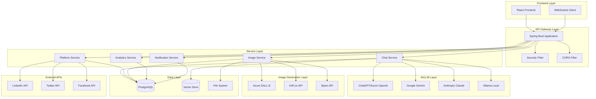
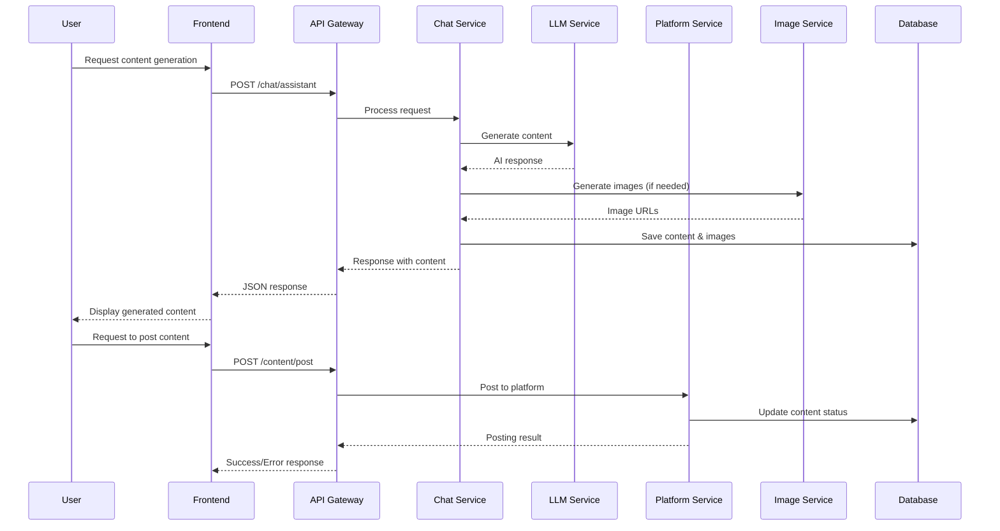
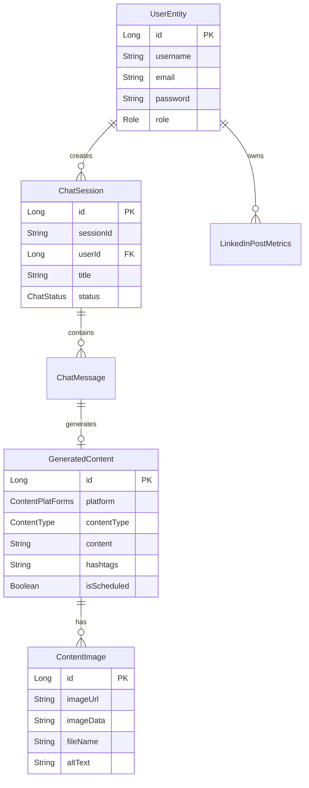

# PostPilot - AI-Powered Content Generation & Social Media Management Platform

[ ](https://spring.io/projects/spring-boot)
[ ](https://openjdk.java.net/)
[ ](https://www.postgresql.org/)
[ ](https://spring.io/projects/spring-ai)

PostPilot is a comprehensive AI-powered content generation and social media management platform that leverages multiple Large Language Models (LLMs) to create, schedule, and analyze social media content across various platforms.

## 🚀 Features

### 🤖 Multi-LLM Content Generation

* **ChatGPT Integration** (Azure OpenAI & OpenAI)
* **Google Gemini** (Vertex AI)
* **Anthropic Claude**
* **Ollama** (Local LLM support)
* **Fallback mechanisms** for high availability

### 📱 Social Media Platform Support

* **LinkedIn** (Full OAuth integration)
* **Twitter/X** (Planned)
* **Facebook** (Planned)
* **Instagram** (Planned)

### 🎨 AI Image Generation

* **Azure OpenAI DALL-E** integration
* **A4F.co** image generation
* **Bytez** fallback service
* **Dual storage** (disk + database)
* **Image gallery** with search and filtering

### 💬 Intelligent Chat System

* **Session-based conversations**
* **Chat history** with pagination
* **Real-time messaging** via WebSocket
* **Context-aware responses**

### 📊 Analytics & Insights

* **LinkedIn post metrics** (impressions, clicks, likes, comments, shares)
* **Engagement rate calculations**
* **Performance dashboards**
* **Historical data tracking**

### 🔐 Security & Authentication

* **JWT-based authentication**
* **Role-based access control** (USER, ADMIN, SUPER_ADMIN)
* **OAuth 2.0** for social platforms
* **CORS configuration**

### 📅 Content Management

* **Content scheduling**
* **Draft management**
* **Content status tracking**
* **Bulk operations**

## 🏗️ Technical Architecture

### System Architecture Diagram



### Data Flow Architecture



## 📋 API Documentation

### Authentication Endpoints

```
POST /auth/login          - User login
POST /auth/register       - User registration
POST /auth/refresh        - Token refresh
```

### Chat & Content Generation

```
POST /chat/assistant      - Generate content with AI
GET  /chat/{sessionId}/messages - Get chat history
GET  /chat/create/session - Create new chat session
```

### Content Management

```
POST /content/post        - Post content to social media
POST /content/schedule    - Schedule content posting
PUT  /content/update     - Update generated content
GET  /generated-content   - Get all generated content
```

### Image Management

```
GET  /api/images         - Get all images (paginated)
GET  /api/images/all     - Get all images (simple)
GET  /api/images/{id}     - Get specific image
POST /api/images/upload-for-content - Upload image
GET  /api/images/serve/{fileName} - Serve image file
GET  /api/images/search  - Search images by tag
GET  /api/images/tags    - Get images by tag
```

### Analytics

```
GET  /api/analytics/linkedin/posts/{postId} - Get LinkedIn post metrics
GET  /api/analytics/linkedin/user          - Get user analytics
GET  /api/analytics/linkedin/dashboard     - Get analytics dashboard
```

### Supported Models & Platforms

```
GET  /api/supported/models     - Get active AI models
GET  /api/supported/platforms  - Get supported platforms
```

## 🛠️ Technology Stack

### Backend

* **Java 21** - Programming language
* **Spring Boot 3.5.5** - Application framework
* **Spring Security** - Authentication & authorization
* **Spring Data JPA** - Data persistence
* **Spring AI 1.0.1** - AI/LLM integration
* **PostgreSQL** - Primary database
* **PGVector** - Vector database for embeddings

### AI/ML Integration

* **Azure OpenAI** - ChatGPT & DALL-E
* **Google Vertex AI** - Gemini models
* **Anthropic Claude** - Claude models
* **Ollama** - Local LLM support

### Image Generation

* **Azure OpenAI DALL-E** - Primary image generation
* **A4F.co** - Alternative image generation
* **Bytez** - Fallback image service

### External Integrations

* **LinkedIn API** - Social media posting & analytics
* **OAuth 2.0** - Social platform authentication

### Development Tools

* **Maven** - Build tool
* **Lombok** - Code generation
* **JWT** - Token-based authentication
* **WebSocket** - Real-time communication

## ⚙️ Configuration

### Environment Variables

Create a `config.properties` file with the following variables:

```properties
# Azure OpenAI Configuration
AZURE_OPENAI_API_KEY=your_azure_openai_key
AZURE_OPENAI_ENDPOINT=https://your-resource.openai.azure.com/
AZURE_OPENAI_DEPLOYMENT_NAME=your-deployment-name
AZURE_OPENAI_IMAGE_DEPLOYMENT_NAME=your-image-deployment

# OpenAI Configuration
OPENAI_API_KEY=your_openai_key

# Anthropic Configuration
ANTHROPIC_API_KEY=your_anthropic_key

# LinkedIn API Configuration
LINKEDIN_CLIENT_ID=your_linkedin_client_id
LINKEDIN_CLIENT_SECRET=your_linkedin_client_secret
LINKEDIN_AUTH_URL=your_redirect_url
LINKEDIN_AUTH_SCOPE=your_scope

# Image Generation APIs
A4F_API_KEY=your_a4f_key
BYTEZ_KEY=your_bytez_key
```

### Database Configuration

```properties
# PostgreSQL Configuration
spring.datasource.url=jdbc:postgresql://localhost:5432/post_pilot
spring.datasource.username=postgres
spring.datasource.password=your_password
spring.datasource.driver-class-name=org.postgresql.Driver
```

### Image Storage Configuration

```properties
# Image Storage
image.upload.directory=uploads/images/
image.serve.url-prefix=/api/images/serve/
```

## 🚀 Getting Started

### Prerequisites

* **Java 21** or higher
* **Maven 3.6+**
* **PostgreSQL 15+**
* **Node.js 18+** (for frontend)

### Installation


1. **Clone the repository**

   ```bash
   git clone https://github.com/your-username/postpilot.git
   cd postpilot
   ```
2. **Configure the database**

   ```bash
   # Create PostgreSQL database
   createdb post_pilot
   
   # Run the SQL script
   psql -d post_pilot -f src/main/resources/postgres.sql
   ```
3. **Configure environment variables**

   ```bash
   # Copy the example config
   cp config.properties.example config.properties
   
   # Edit with your API keys
   nano config.properties
   ```
4. **Build the application**

   ```bash
   mvn clean compile
   ```
5. **Run the application**

   ```bash
   mvn spring-boot:run
   ```

The application will start on `http://localhost:8080`

### Development Setup


1. **Install dependencies**

   ```bash
   mvn clean install
   ```
2. **Run tests**

   ```bash
   mvn test
   ```
3. **Generate documentation**

   ```bash
   mvn asciidoctor:process-asciidoc
   ```

## 🐳 Docker Deployment

### Build Docker Image

```bash
# Build the application
mvn clean package

# Build Docker image
docker build -t postpilot:latest .
```

### Docker Compose

```yaml
version: '3.8'
services:
  postpilot:
    image: postpilot:latest
    ports:
      - "8080:8080"
    environment:
      - SPRING_DATASOURCE_URL=jdbc:postgresql://postgres:5432/post_pilot
      - SPRING_DATASOURCE_USERNAME=postgres
      - SPRING_DATASOURCE_PASSWORD=password
    depends_on:
      - postgres
    volumes:
      - ./uploads:/app/uploads

  postgres:
    image: postgres:15
    environment:
      - POSTGRES_DB=post_pilot
      - POSTGRES_USER=postgres
      - POSTGRES_PASSWORD=password
    volumes:
      - postgres_data:/var/lib/postgresql/data
    ports:
      - "5432:5432"

volumes:
  postgres_data:
```

## 🔧 API Usage Examples

### Generate Content

```bash
curl -X POST http://localhost:8080/chat/assistant \
  -H "Content-Type: application/json" \
  -H "Authorization: Bearer YOUR_JWT_TOKEN" \
  -d '{
    "prompt": "Create a LinkedIn post about AI trends",
    "model": "gpt-4",
    "platform": "linkedin",
    "contentType": "TEXT"
  }'
```

### Upload Image

```bash
curl -X POST http://localhost:8080/api/images/upload-for-content \
  -H "Authorization: Bearer YOUR_JWT_TOKEN" \
  -F "file=@image.jpg" \
  -F "generatedContentId=123" \
  -F "altText=AI generated image"
```

### Get Analytics

```bash
curl -X GET http://localhost:8080/api/analytics/linkedin/user \
  -H "Authorization: Bearer YOUR_JWT_TOKEN"
```

## 📊 Database Schema

### Core Entities

* **UserEntity** - User management and authentication
* **ChatSession** - Chat conversation sessions
* **ChatMessage** - Individual chat messages
* **GeneratedContent** - AI-generated content
* **ContentImage** - Generated and uploaded images
* **LinkedInPostMetrics** - LinkedIn analytics data

### Entity Relationships



## 🔒 Security Features

### Authentication & Authorization

* **JWT-based authentication** with configurable expiration
* **Role-based access control** (USER, ADMIN, SUPER_ADMIN)
* **Password encryption** using BCrypt
* **CORS configuration** for cross-origin requests

### API Security

* **Request validation** using Bean Validation
* **SQL injection prevention** via JPA
* **XSS protection** through input sanitization
* **Rate limiting** (configurable)

### Data Protection

* **Sensitive data encryption** in database
* **API key management** via environment variables
* **Secure file upload** with validation
* **Audit logging** for security events

## 📈 Performance & Scalability

### Caching Strategy

* **Redis integration** for session management
* **Database query optimization** with JPA
* **Image caching** for improved performance
* **API response caching** for static data

### Monitoring & Logging

* **Structured logging** with SLF4J
* **Performance metrics** collection
* **Error tracking** and alerting
* **Health check endpoints**

## 🤝 Contributing


1. Fork the repository
2. Create a feature branch (`git checkout -b feature/amazing-feature`)
3. Commit your changes (`git commit -m 'Add amazing feature'`)
4. Push to the branch (`git push origin feature/amazing-feature`)
5. Open a Pull Request

### Development Guidelines

* Follow Java coding standards
* Write comprehensive tests
* Update documentation
* Ensure security best practices

## 📝 License

This project is licensed under the MIT License - see the [LICENSE](LICENSE) file for details.

## 🆘 Support

For support and questions:

* Create an issue in the repository
* Contact the development team
* Check the documentation wiki

## 🔮 Roadmap

### Upcoming Features

- [ ] **Multi-language support** for content generation
- [ ] **Advanced analytics** with machine learning insights
- [ ] **Content templates** and reusable components
- [ ] **Team collaboration** features
- [ ] **Advanced scheduling** with timezone support
- [ ] **Content approval workflows**
- [ ] **Integration with more social platforms**

### Technical Improvements

- [ ] **Microservices architecture** migration
- [ ] **Kubernetes deployment** support
- [ ] **Advanced caching** strategies
- [ ] **Real-time collaboration** features
- [ ] **API versioning** implementation


---

**PostPilot** - Empowering content creators with AI-driven social media management.
